## Practice-1： Linux 基础

    ### P1-1: 完成SSH连接与端口映射并运行hello_world.py	
  
  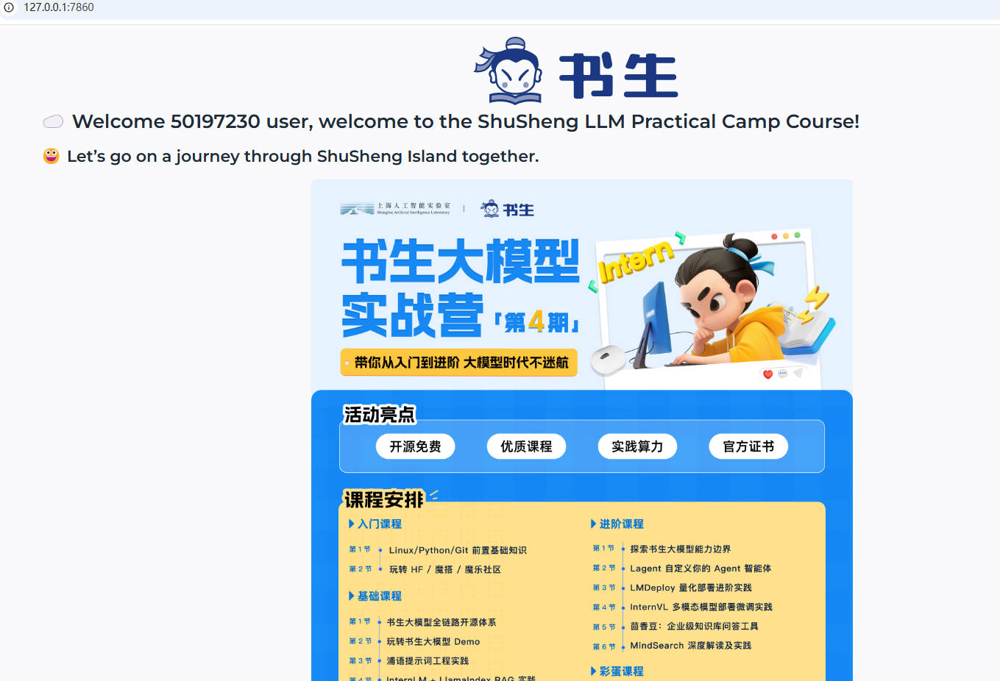
    
    
    ### P1-2: 将Linux基础命令在开发机上完成一遍	

  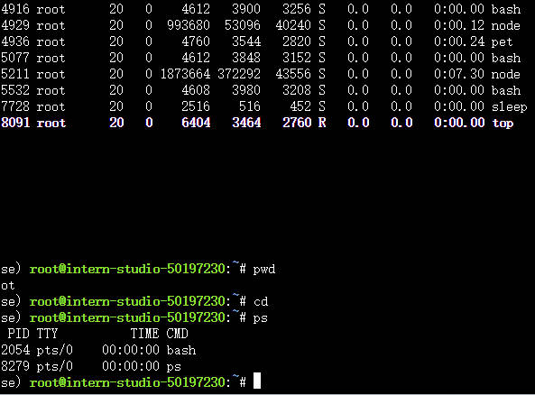
  
  
    ###  P1-3: 使用 VSCODE 远程连接开发机并创建一个conda环境
  
  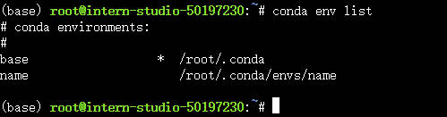

## Practice-2： Python 基础

  ### P2-1: Leetcode_383代码
  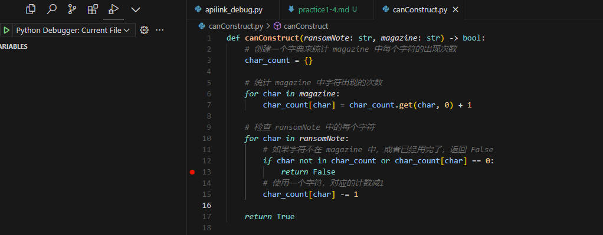

  
  ### P2-1: 使用SSH远程连接开发机debugging修复
  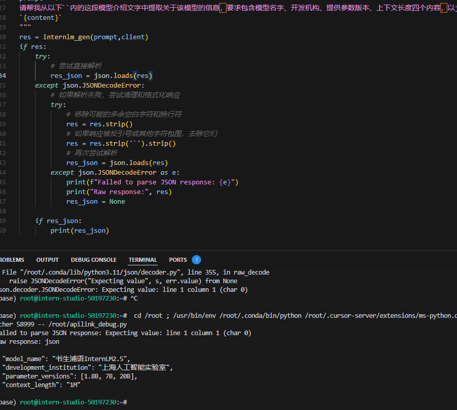
  

## Practice-3： git 基础

  ### P3-1任务1: 破冰活动：自我介绍

  
  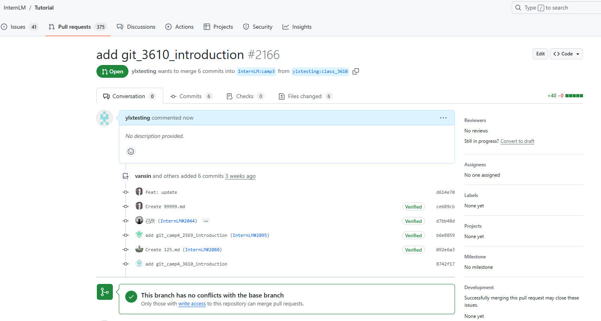
  

  

  ### P3-2任务2: 实践项目：构建个人项目

  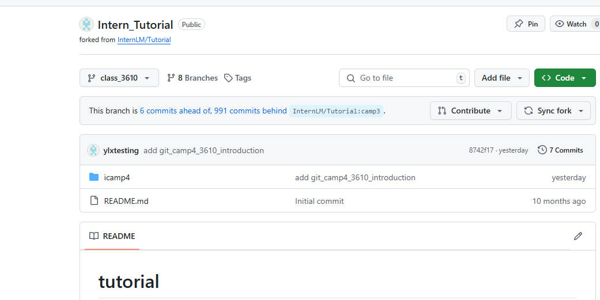

  repo link:https://github.com/ylxtesting/Intern_Tutorial/

## Practice-4： 大模型社区

  ### P4-1: 模型下载	使用HF下载模型

  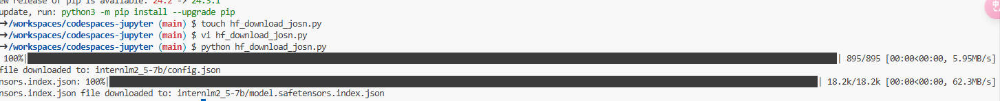

  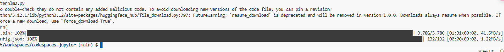

  ### P4-2: 模型上传, 将下载的config.json文件上传到HF平台
  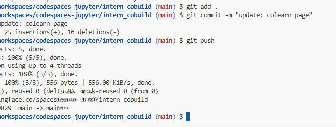

  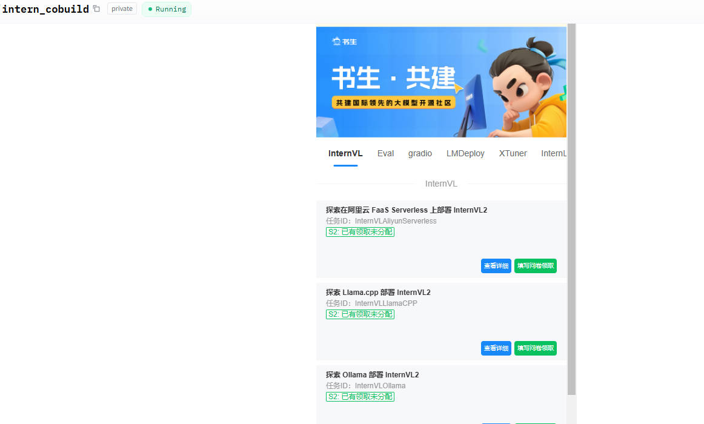

  
  ### P4-3: Space上传	在HF平台上使用Spaces并把intern_cobuild部署成功
  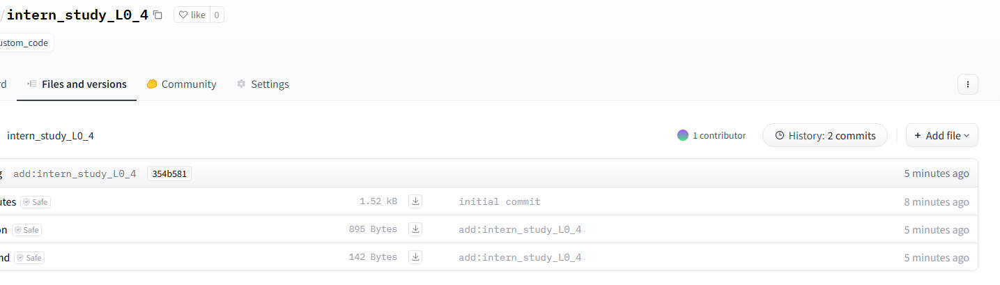
  
