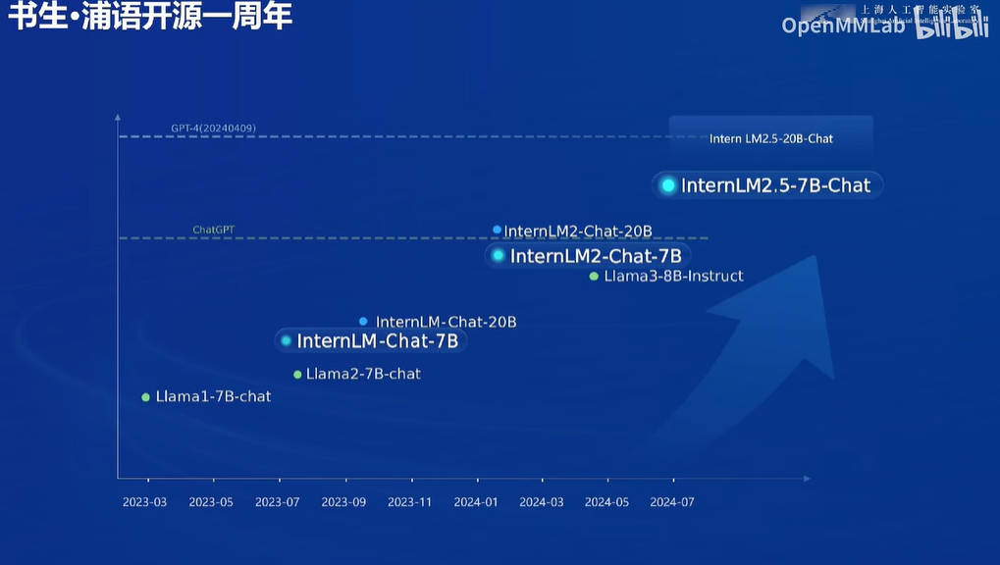
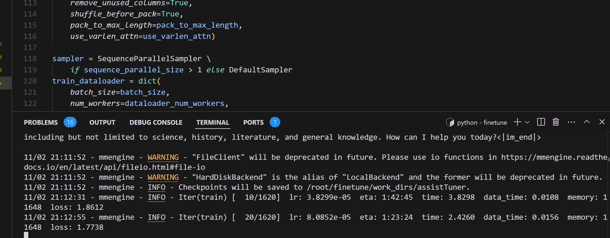

## L1   Practice-1： 第 1 关	书生大模型全链路开源体系	

    ### P1-1:  书生大模型全链路开源开放体系历史	
  
  
    
    
    ### P1-2:  书生大模型全链路开源开放体系

  
  
  
    ###  P1-3: 书生大模型全链路开源开放体系--预训练InterEvo
  
  

    ###  P1-4: 书生大模型全链路开源开放体系--预训练 Xtuner
  
  

      ###  P1-5: 书生大模型全链路开源开放体系--部署LMDeploy
  
  

        ###  P1-6: 书生大模型全链路开源开放体系--智能体Lagent
  
  

      ###  P1-7: 书生大模型全链路开源开放体系--RAG茴香豆
  
  

      ###  P1-8: 书生大模型全链路开源开放体系--评估OpenCompass
  
  

## L1 Practice-2： 第 2 关	玩转书生「多模态对话」和「AI搜索」产品

  
  ### P2-1: 玩转书生和「AI搜索」产品

  MindSearch问题1：

  
  
  MindSearch问题2：

  
  
  MindSearch问题3：

  

  ### P2-1: 玩转书生.浦语

  

  ### P3-1: 玩转书生「多模态对话」

  

## L1 Practice-3： 第 3 关	浦语提示词工程实践	

  ### P3-1任务1: 引导语言模型正确回答出“strawberry”中有几个字母“r”

  
  
  

  

  ### P3-2任务2: 进阶：剧本创作助手
  
  添加提示词前：
  

  添加如下提示词：
  

  添加提示词后最终结果：
   

### P3-3 任务3: 进阶：科幻小说生成

更新prompts：

  

开始创作：

  

创作结果：

  

中途第12章出现英文：
  

生产md文件
  

## L1 Practice-4： 第 4 关	InternLM + LlamaIndex RAG 实践	

  ### P4-1: 基于 LlamaIndex 构建自己的 RAG 知识库，借助 LlamaIndex 后浦语 API 具备回答 A 的能力

RAG 知识库构建前API：

  

RAG 知识库构建后API：

  

 

  ### P4-2: 基于 LlamaIndex 构建自己的 RAG 知识库， LlamaIndex 后 InternLM2-Chat-1.8B 模型具备回答 A 的能力

  RAG 知识库构建前本地模型：

  

RAG 知识库构建后本地模型：

  

  ### P4-3: 基于 LlamaIndex和浦语API部署到HF

  创建app.py：

  
  

  更新app.py,使用hf上的sentence model，同时更新data目录：

  

  这两行代码更新为：

  

  创建requirement.txt

  
  

  上传到hf，然后开始自动构建：

  

  成功运行：

  

  
  
  HF spaces上的文件清单：

  

  
## L1 Practice-5： 第 6 关	XTuner 微调个人小助手认知

  ### P5-1: 使用 XTuner 微调 InternLM2-Chat-7B 实现自己的小助手认知

开始用XTuner微调：

  

XTuner微调中GPU使用情况：
  

XTuner微调后小助手名字更新：

  

  

  

  

### P5-2: 上传微调后的模型到ModelScope

用XTuner完成微调：

  

XTuner微调后的adapter文件：

  

合并后的文件：

    

上传到ModelScope：

    

  ## L1 Practice-6： 第 7 关	OpenCompass 评测书生大模型实践

  ### P4-1: 使用 OpenCompass 评测浦语 API 记录复现过程并截图
    运行前数据准备：

  

  运行评估遇到问题：
  

 修复问题：
  

  展示config list：

  

  OpenCompass评测中：

  

  展示评测结果：

  

