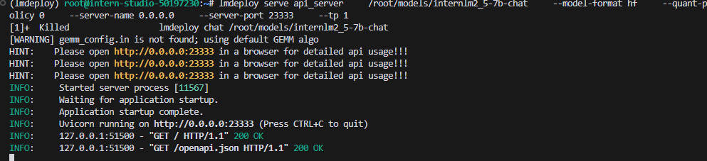

## L2   Practice-1： 第 1 关	探索书生大模型能力边界

    ### P1-1:  书生大模型全链路开源开放体系历史	
  
  
    
    
    ### P1-2:  书生大模型全链路开源开放体系

  
  
  
    ###  P1-3: 书生大模型全链路开源开放体系--预训练InterEvo
  
  

    ###  P1-4: 书生大模型全链路开源开放体系--预训练 Xtuner
  
  

      ###  P1-5: 书生大模型全链路开源开放体系--部署LMDeploy
  
  

        ###  P1-6: 书生大模型全链路开源开放体系--智能体Lagent
  
  

      ###  P1-7: 书生大模型全链路开源开放体系--RAG茴香豆
  
  

      ###  P1-8: 书生大模型全链路开源开放体系--评估OpenCompass
  
  

## L2 Practice-2： 第 2 关	Lagent：从零搭建你的 Multi-Agent

  
  ### P2-1: 使用 Lagent 复现文档中 “制作一个属于自己的Agent” 

  安装Lagent：

  
  
  Lagent启动：

  
  
  页面显示：

  

  不选择plugin问问题会报错：

  
  
  Lagent启动ArxivSearch插件：

  

  Lagent启动ArxivSearch插件--询问另一个问题：

  
  
  创建自己的Agent -- 和风天气的 API 服务：

  

  创建自己的Agent -- 和风天气创建项目：

  

  创建自己的Agent -- 不启动weather插件并询问实时天气：

  

  创建自己的Agent -- 启动weather插件并询问实时天气：

  

  创建自己的Agent -- 开启ArxivSearch和weather2个插件并询问：

  

  

  

  ### P2-2: Multi-Agents博客写作系统的搭建

多代理：
  

多代理第二步：
  

多代理第三步：
  

多代理结果：
  

  ### P2-3: Lagent上传hf

创建app.py：

  

创建requirement.txt：

  

创建hf spaces：

  

添加secret：

  

成功运行应用：

  

## L2 Practice-3： 第 3 关  LMDeploy 量化部署进阶实践	

  ### P3-1任务1: LMDeploy环境

  环境部署成功后对话创建一个故事：

  
  
 环境部署成功后对话创建一个故事时的GPU显存使用量：
  
  

 环境部署成功后对话创建一个故事时的GPU显存使用量--nvidia-smi：
  
  

 环境部署成功后对话创建一个故事时的GPU显存使用量-studio-smi：
  
  

  ### P3-2任务2: LMDeploy与InternLM2.5
  
  启动API服务器，部署InternLM2.5模型：
  

  fastapi页面启动：
  

  其GPU内存使用：
  

 API对话启用：
   

 以Gradio网页形式连接API服务器：
   

 以Gradio网页形式连接API服务器 --Gradio页面：
   

设置最大kv cache缓存大小 --cache-max-entry-count参数

   

设置最大kv cache缓存大小 ----cache-max-entry-count 0.4 减少4G显卡内存

   

设置在线 kv cache int4/int8 量化 -- quant_policy=4

   

设置在线 kv cache int4/int8 量化 -- quant_policy=4 显卡内存

      

设置在线 kv cache int4 -- 1.8B模型进行量化 --开始量化

      

设置在线 kv cache int4 -- 1.8B模型进行量化 --量化完成 --大约1小时+

      

设置在线 kv cache int4 -- 1.8B模型进行量化 --量化后文件大小

      

设置在线 kv cache int4 -- 1.8B模型进行量化 --原始模型的文件大小

      

设置在线 kv cache int4 -- 1.8B模型进行量化 --原始显卡内存大小

      

设置在线 kv cache int4 -- 1.8B模型进行量化 --优化后显卡内存大小

      

W4A16 量化+ KV cache+KV cache 量化

  

W4A16 量化+ KV cache+KV cache 量化--显卡内存使用：

  

### P3-3 任务3: LMDeploy与InternVL2

针对InternVL系列模型执行模型的量化工作--大概需要12小时--每个layer大概需要14分钟：
此步骤安装flashAttention后每步骤大概需要12分钟

  

针对InternVL系列模型执行模型的量化工作--CPU和内存资源使用：

  

针对InternVL系列模型执行模型的量化工作--完成时Terminal输出：

  

针对InternVL系列模型执行模型的量化工作--weight packed：
  

针对InternVL系列模型执行模型的量化工作--完成后文件：

  

### P3-4 任务4: LMDeploy之FastAPI与Function call

LMDeploy之FastAPI：

  

LMDeploy之FastAPI --第一个Terminal输出：

  

LMDeploy之FastAPI --funciton_call：

  

## L2 Practice-4： 第 4 关	InternVL 多模态模型部署微调实践

  ### P4-1: LMDeploy搭建InternVL2-2B

LMDeploy搭建InternVL2-2B：

  

InternVL2-2B页面：

  

InternVL2-2B启动时GPU显存的使用量：

  

### P4-2: XTuner微调InternVL2-2B实践

 微调终端显示：

  

微调时GPU的显卡使用量：

  

微调时CPU和内存使用量：

  

微调完成：

  

微调结果：

  

微调后启动网页应用：

  

### P4-3: 上传XTuner微调后的InternVL2-2B模型到ModelScope

 微调InternVL2-2B模型：

  

 转换模型：

  

本地文件：

  

上传到ModelScope后的文件清单：

  

  
## L2 Practice-5： 第 5 关	茴香豆：企业级知识库问答工具

  ### 本节无闯关任务，不作为进阶闯关的要求～

  ## L2 Practice-6： 第 6 关	MindSearch深度解析及实践

  ### P6: 在官方的MindSearch页面 复制Spaces应用到自己的Spaces下，并在必要的步骤以及成功的对话测试结果

  复制后运行：

  

  运行遇到问题log输出：
  

  运行遇到问题界面：
  

  重启Spaces修复问题：
  

  正确结果展示：

  

  